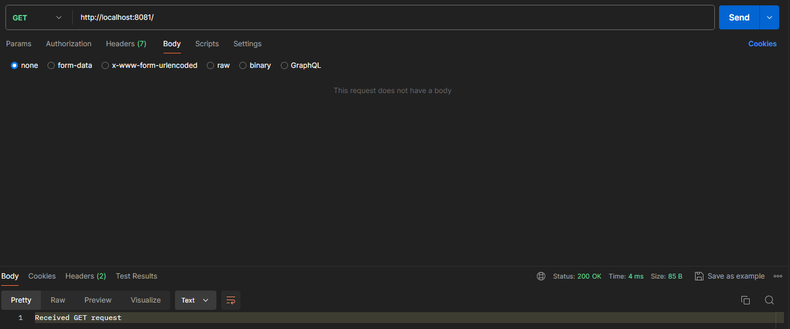
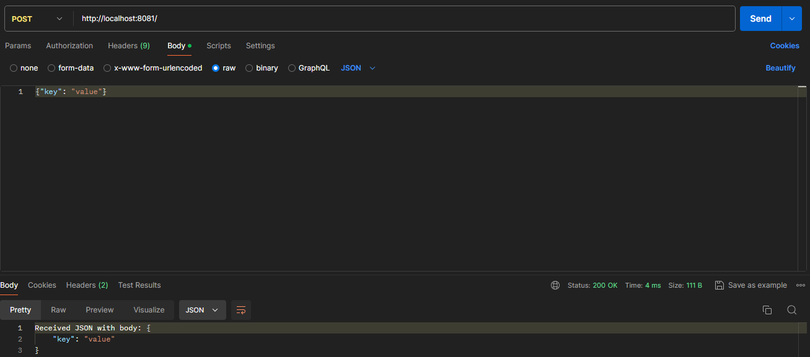
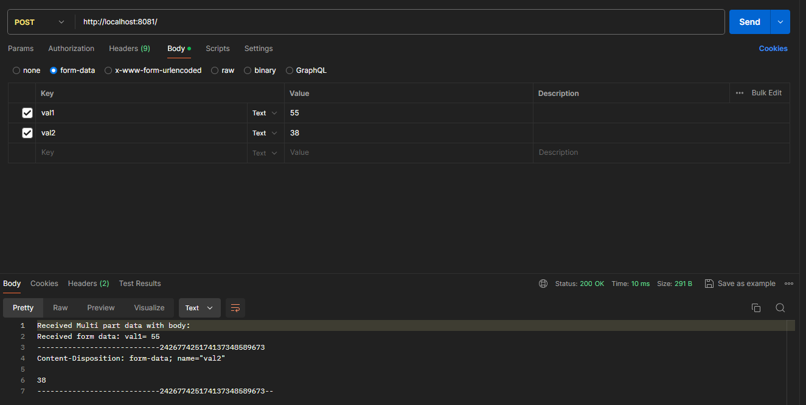
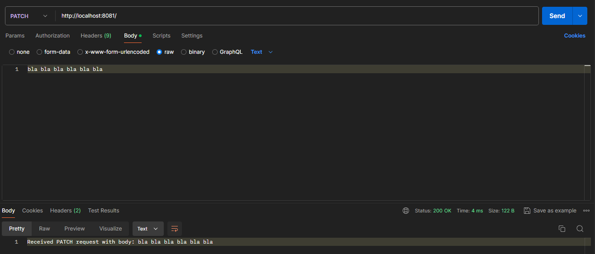
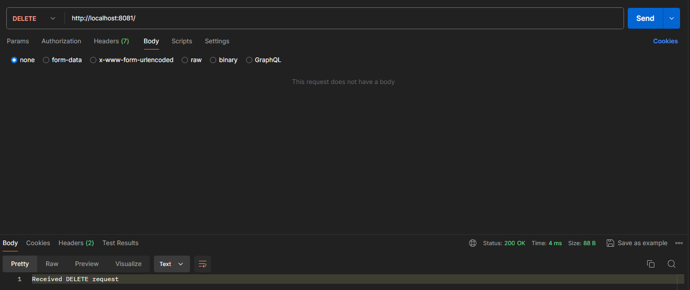

# Simple HTTP Server

This is a simple HTTP server implemented in Java using non-blocking I/O with the `java.nio` package. The server supports handling GET, POST, PUT, PATCH, and DELETE requests.

## Features

- Handles GET, POST, PUT, PATCH, and DELETE requests
- Supports JSON and multipart/form-data request bodies
- Allows registering custom handlers for specific paths and HTTP methods

## Getting Started

To run the HTTP server, follow these steps:

1. Clone the repository:
   ```git clone https://github.com/your-username/http-server.git```

2. Navigate to the project directory:
   ```cd httpServer```

3. Compile the Java source files:
   ```mvn clean package```

4. Run the server:
   ```java -jar target/httpServer-1.0-SNAPSHOT.jar```

The server will start running on `localhost` with the port 8081.

## Usage

You can use Postman to send requests to the server. Here some examples:

### GET Request

Send a GET request to the server:



### POST Request with JSON Body

Send a POST request with a JSON body:



### PUT Request with Multipart/Form-Data

Send a PUT request with multipart/form-data containing form fields and files:



### PATCH Request

Send a PATCH request with a request body:



### DELETE Request

Send a DELETE request:



## Customization

To add handlers for specific paths and HTTP methods you can create a new instance of the `Handler` interface 
and register it using the `registerHandler` method of the `Server` class.

For example:

```java
Server server = new Server("localhost", 8081);
server.registerHandler("/hello", "GET", (req, res) -> {
    res.sendText(200, "Hello, World!");
});
```